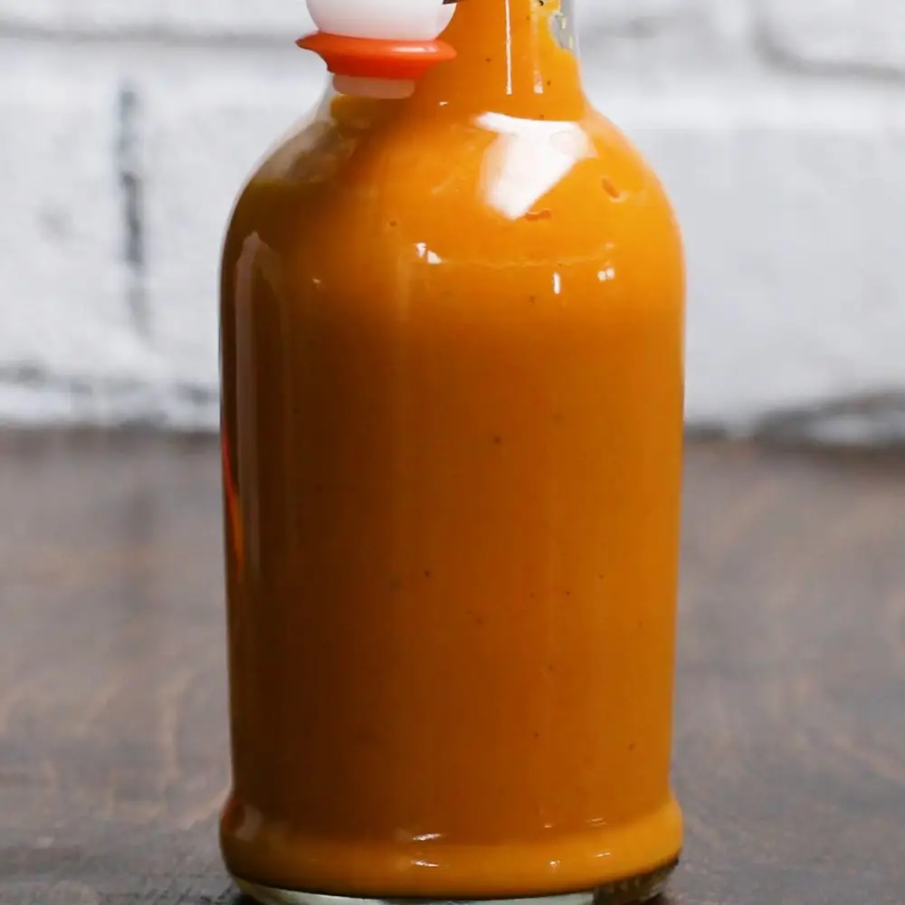

# Chipotle Hot Sauce

#cooking

Recipe from https://tasty.co/recipe/habanero-hot-sauce

- 10 habanero peppers, seeded, halved
-  6 cloves garlic, smashed
-  2 tablespoons olive oil
-  2-3 medium size carrots, chopped
-  1 onion, chopped
-  1 ½ teaspoons salt
-   2.5 dl water
- 1 juiced lime
- 1 small cap of ättika 

## Preparation

1.  Preheat the oven to 220˚C. Line a baking sheet with parchment paper.
2.  Place the habanero peppers and garlic on the baking sheet. Drizzle with 1 tablespoon of olive oil and toss with tongs to coat. NOTE: Do not touch the peppers with your bare hands.
3.  Roast for 10 minutes, until the edges of the peppers are brown.
4.  Add the remaining tablespoon of olive oil to a large pot over high heat. Add the carrot, onion, and salt. Cook for 4 minutes, until the vegetables are tender and glossy.
5.  Add the water, lime juice, white vinegar, and the roasted peppers and stir. Bring to a boil, then reduce the heat to medium-low and simmer for 10 minutes.
6.  Remove the pot from the heat and let cool.
7.  Pour the vegetable mixture into a blender and puree until smooth.
8.  Using a funnel, pour the sauce into a bottle or jar and store in the refrigerator for up to 2 weeks.
9.  Enjoy!

